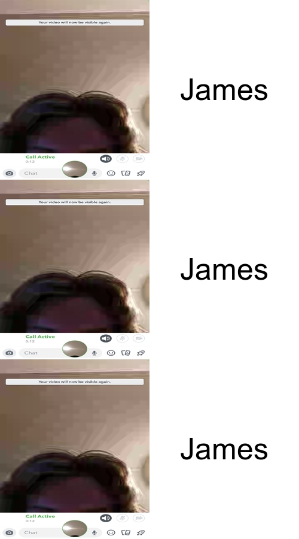

# Assignment 1

## Motivation 
The meme is extremely rare, not seen before in **any** NFT market including Opensea. The inspiration and motivation behind this *exotic* meme is James. The thought simply came, like James existence. "It must be carefully hand crafted, measured down the to the micrometer and aged perfectly," is what I thought upon summoning this meme. The summon ritual to procure this meme was **no joke**. I had to sacrifice two functional members to gather the *ingredients* for this, you cannot even fathom the **steps** taken to gather these exquisite materials. 
## Code 
```R
library(magick)

img_panel1 <- image_read("https://media.discordapp.net/attachments/686807262773510168/907591046609928212/IMG_5815.png")
img_panel2 <- image_read("https://media.discordapp.net/attachments/686807262773510168/907591046609928212/IMG_5815.png")
img_panel3 <- image_read("https://media.discordapp.net/attachments/686807262773510168/907591046609928212/IMG_5815.png")

blank_Panel <- image_blank(width = 250, height = 300, color = "#FFFFFF")

text_panel1 <- image_annotate(blank_Panel, color = "#000000", text = "James", size = 50, gravity = "center")
text_panel2 <- image_annotate(blank_Panel, color = "#000000", text = "James", size = 50, gravity = "center")
text_panel3 <- image_annotate(blank_Panel, color = "#000000", text = "James", size = 50, gravity = "center")

combine_panel1 <-  c(image_resize(img_panel1, "250x300!"), text_panel1) %>%
                                image_append() 
combine_panel2 <- c(image_resize(img_panel2, "250x300!"), text_panel2) %>%
                              image_append() 
combine_panel3 <- c(image_resize(img_panel3, "250x300!"), text_panel3) %>%
                                image_append() 

final <- c(combine_panel1, combine_panel2, combine_panel3) %>%
                                image_append(stack = TRUE) 
final

image_write(final, "saves/my_meme.png")

```
